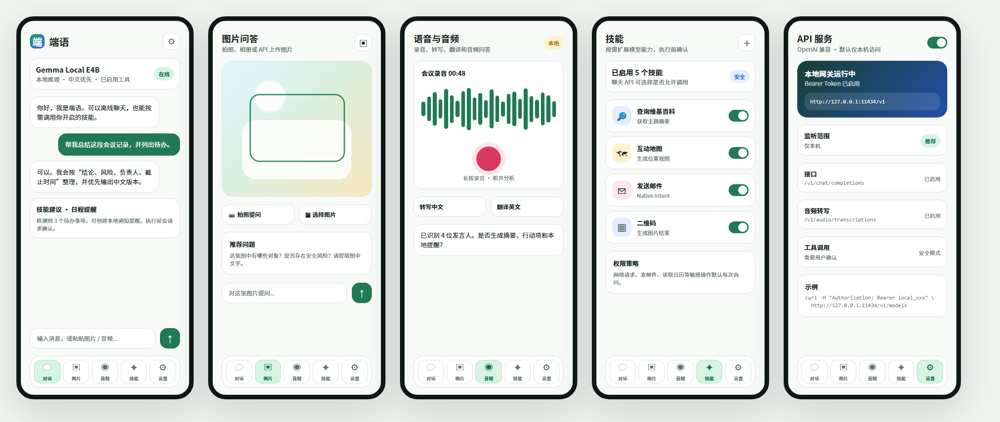

<div align="center">
  <p>
    
  </p>
  <h1>端语 DuanYu</h1>
  <p><strong>端侧 AI 助手 / OpenAI 兼容本地网关 / 中文优先 / 图片问答 / 音频转写 / Agent Skills</strong></p>
  <p>一个基于 Google AI Edge Gallery 技术底座改造的新 Android 应用，目标是在手机本地提供可使用、可扩展、可通过 API 集成的 AI 能力。</p>
  <p>
    
    
    
  </p>
  <p>
    
    
    
  </p>
</div>

---

## 1. 项目说明

**端语** 是中文品牌名，英文名建议使用 **DuanYu**。这里不做直译，而是保留中文品牌的音译，读起来也更像一个独立产品名。

本仓库是从 Google AI Edge Gallery 技术底座整理出的新 Android 项目。当前阶段已进入端语 App 改造：应用标识、五入口主界面、设置页、语言切换和目标功能范围收口已经落地。

已经包含：

- 产品需求文档：[product-docs/DuanYu-PRD.md](product-docs/DuanYu-PRD.md)
- 实施计划文档：[docs/IMPLEMENTATION_PLAN.md](docs/IMPLEMENTATION_PLAN.md)
- UI 概念图：[product-docs/assets](product-docs/assets)
- APK 图标素材：[brand](brand)
- 上游 Android 技术底座：[Android](Android)
- Agent Skills 示例：[skills](skills)
- MCP 文档和示例：[mcp](mcp)

## 2. 目标功能

第一版聚焦这些能力：

- AI Chat：中文优先的本地多轮对话。
- Ask Image：拍照、相册导入、图片问答、文字提取。
- Audio Scribe / Ask Audio：录音、音频导入、转写、翻译、摘要。
- Agent Skills：内置技能、URL 导入、本地导入、权限确认、密钥管理。
- 通知功能：模型下载通知、本地提醒、权限管理。
- 主题与设置：浅色、深色、跟随系统。
- i18n：仅支持简体中文和英文。
- OpenAI 兼容 API：提供 `/v1/chat/completions` 等本地接口。

暂不保留 Benchmark、Prompt Lab、Tiny Garden、Mobile Actions 等实验入口。

## 3. UI 预览


单页概念图：

- [对话首页](product-docs/assets/duanyu-chat.png)
- [图片问答](product-docs/assets/duanyu-image.png)
- [语音与音频](product-docs/assets/duanyu-audio.png)
- [技能管理](product-docs/assets/duanyu-skills.png)
- [API 设置](product-docs/assets/duanyu-api-settings.png)

## 4. 品牌素材

当前 APK 图标选择 **C：离线助手感**。

正式图标文件：

- [brand/app-icon.svg](brand/app-icon.svg)
- [brand/app-icon.png](brand/app-icon.png)

其余备选方案见：[brand/logo-concepts](brand/logo-concepts)

## 5. 计划中的 API

默认本机地址：

```text
http://127.0.0.1:11434/v1
```

第一阶段接口：

```text
GET  /health
GET  /v1/models
POST /v1/chat/completions
POST /v1/audio/transcriptions
GET  /v1/skills
POST /v1/skills/{name}/run
```

API 默认关闭。开启后默认只监听 `127.0.0.1`，局域网访问需要用户手动开启，并强制使用 Bearer Token。

## 6. 仓库结构

```text
.
├─ Android/
├─ brand/
├─ mcp/
├─ product-docs/
├─ skills/
├─ README.md
├─ GIT_COMMIT_RULES.md
└─ LICENSE
```

说明：

- `Android/` 是后续 Android App 改造主目录。
- `product-docs/` 存放 PRD 和 UI 概念图。
- `brand/` 存放 APK 图标和品牌素材。
- `skills/` 和 `mcp/` 保留用于 Agent 能力设计参考。

## 7. 开发路线

### M1：最小可用版本

- 新 UI 骨架
- Chat
- 模型中心
- 中文/英文 i18n
- 主题设置
- 基础通知
- `/v1/models`
- `/v1/chat/completions`

### M2：多模态版本

- Ask Image
- Audio Scribe
- Ask Audio
- 图片 API 输入
- `/v1/audio/transcriptions`
- SSE 流式响应

### M3：Agent 版本

- Skills 管理
- JS Skill 执行
- Secret 管理
- 技能权限确认
- API 侧工具调用开关

## 8. 提交规则

本仓库使用流水号提交格式：

```text
001:新增:初始化端语项目文档与规范
002:调整:选定端语 APK 图标
003:修复:统一 UI 概念图底部导航
```

详细规则见：[GIT_COMMIT_RULES.md](GIT_COMMIT_RULES.md)

## 9. 许可

当前项目技术底座来自 Google AI Edge Gallery，保留上游 Apache-2.0 许可。后续新增代码和素材的许可策略待正式发布前确认。
