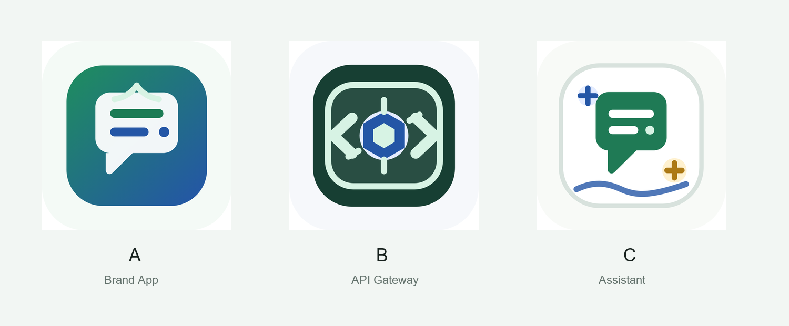

# 端语 DuanYu Logo 概念

本目录包含 3 个 APK 图标方向。每个方向都提供 SVG 源文件和 1024 PNG 预览。

## 已选方案

当前已选：**C：离线助手感**

正式图标文件已复制到：

- [../app-icon.svg](../app-icon.svg)
- [../app-icon.png](../app-icon.png)

## 总览



## A：端语品牌感

文件：

- [duanyu-logo-a.svg](duanyu-logo-a.svg)
- [duanyu-logo-a.png](duanyu-logo-a.png)

特点：

- 对话气泡作为主体，最贴近“端语 / DuanYu”。
- 绿色和蓝色组合，和当前 UI 概念一致。
- 适合普通用户 App 图标。

## B：API 网关感

文件：

- [duanyu-logo-b.svg](duanyu-logo-b.svg)
- [duanyu-logo-b.png](duanyu-logo-b.png)

特点：

- 代码括号和中心节点表达 OpenAI-compatible gateway。
- 技术感更强，更像开发者工具。
- 如果产品主卖点是本地 API 服务，可以选这一版。

## C：离线助手感

文件：

- [duanyu-logo-c.svg](duanyu-logo-c.svg)
- [duanyu-logo-c.png](duanyu-logo-c.png)

特点：

- 白底、气泡、辅助符号组合，亲和力更强。
- 多模态助手感明显，比较轻量。
- 更适合“中文优先的本地助手”定位。

## 仓库名建议

最推荐：

```text
duanyu-android
```

理由：

- 简短直接。
- 明确这是 Android App。
- 和产品名 DuanYu 对齐。
- 后续如果有服务端、文档站、SDK，可以继续扩展：
  - `duanyu-server`
  - `duanyu-docs`
  - `duanyu-sdk`
