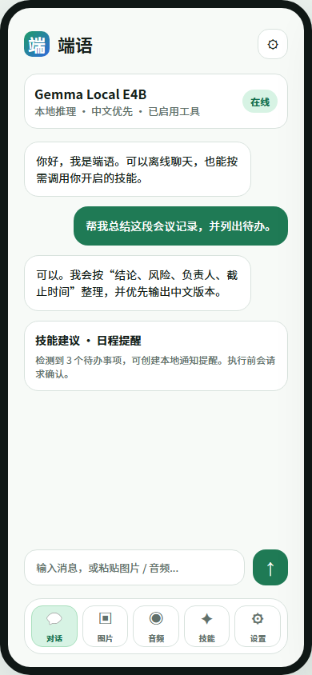
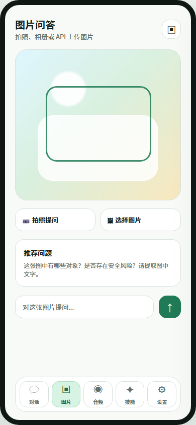
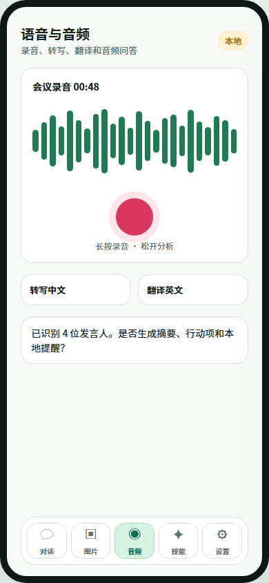
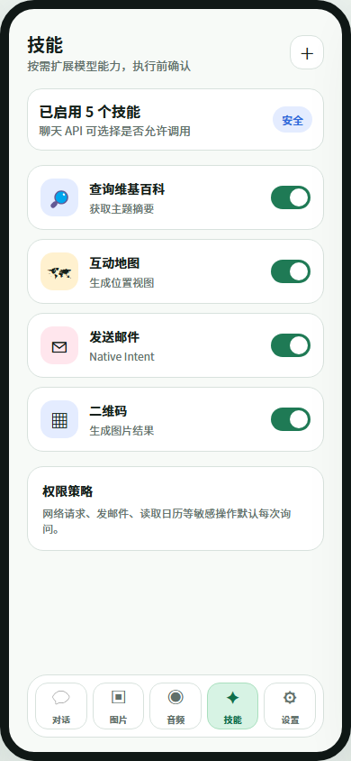
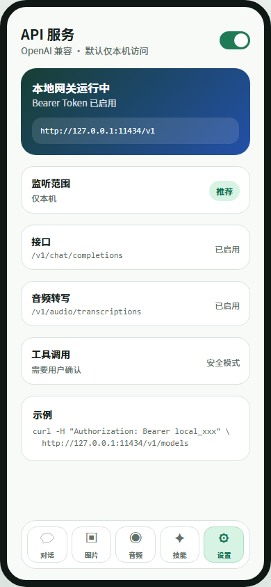

# 端语 DuanYu 产品需求文档

版本：v0.2  
日期：2026-05-29  
语言策略：中文优先，支持中文和英文  
平台：Android  
技术底座：基于 Google AI Edge Gallery 裁剪与重构

## 1. 项目概述

端语是一款以端侧 AI 为核心的移动应用。它面向普通用户提供本地 AI Chat、图片问答、音频转写/问答、Agent Skills、通知和主题设置，同时面向开发者提供 OpenAI 兼容格式的本地 API 服务。

产品目标不是复刻 Google AI Edge Gallery 的完整演示集合，而是将其沉淀为一个更轻量、更中文化、更可集成的端侧 AI 助手。

## 2. 产品命名

中文名：**端语**

英文名：**DuanYu**

命名说明：

- “端”表达端侧推理、隐私、本地运行。
- “语”表达语言助手、对话和多模态理解。
- 英文不建议做生硬直译，容易削弱中文品牌的辨识度。
- 推荐直接使用拼音式品牌名 **DuanYu**，保留中文名称的辨识度，也适合作为 App 名、仓库名和接口文档品牌。

仓库名建议：

```text
duanyu-android
```

后续如果拆分其它仓库，可以延展为：

```text
duanyu-server
duanyu-docs
duanyu-sdk
```

## 3. 产品目标

### 3.1 用户目标

- 用户可以在手机上进行中文优先的本地 AI 对话。
- 用户可以对图片进行提问、识别、总结和文字提取。
- 用户可以录音、导入音频、转写、翻译和摘要。
- 用户可以启用受控技能，让模型按需调用外部能力。
- 用户可以通过本地通知接收任务提醒或下载状态。
- 用户可以在应用内切换中文、英文和主题。

### 3.2 开发者目标

- 开发者可以使用 OpenAI 兼容格式调用手机本地模型。
- 开发者可以通过 `/v1/chat/completions` 接入现有 OpenAI SDK。
- 开发者可以查询模型、上传图片、调用音频转写。
- 开发者可以控制是否允许 API 调用 Agent Skills。
- API 默认只监听本机地址，局域网访问需要用户显式开启。

## 4. 功能范围

### 4.1 保留功能

- AI Chat
- Ask Image
- Agent Skills
- 通知功能
- 主题与设置
- Audio Scribe / Ask Audio
- 精简模型管理
- OpenAI 兼容 API 服务
- i18n 中英文

### 4.2 暂不保留功能

- Benchmark
- Prompt Lab
- Tiny Garden
- Mobile Actions
- Promo 页面
- 示例 Custom Task
- 复杂实验入口

模型管理不能完全删除，因为 Chat、Image、Audio 都依赖模型下载、导入、选择和状态展示。建议将模型管理收敛到设置页下的“模型中心”。

## 5. UI 方向

整体设计建议：安静、现代、偏工具型，不做营销首页。首屏直接进入 Chat。

视觉原则：

- 中文信息密度适中，避免大面积英文演示文案。
- 主色使用绿色和蓝色，表达本地、安全、技术感。
- 底部导航固定为：对话、图片、音频、技能、设置；每个 Tab 使用“图标 + 中文文字”，降低理解成本。
- 卡片只用于功能块、消息、设置项和技能项，不做复杂装饰。
- API 服务属于设置页重点模块，给开发者清晰入口。

### 5.1 UI 总览


### 5.2 对话首页



核心元素：

- 当前模型状态
- 本地推理状态
- 聊天消息
- 技能调用建议
- 输入框
- 底部导航

### 5.3 图片问答



核心元素：

- 拍照入口
- 相册入口
- 图片预览
- 推荐问题
- 图片提问输入框

### 5.4 语音与音频



核心元素：

- 录音按钮
- 音频波形
- 转写中文
- 翻译英文
- 摘要与行动项建议

### 5.5 技能管理



核心元素：

- 已启用技能数量
- 技能列表
- 技能开关
- 权限策略说明
- 添加技能入口

### 5.6 API 设置



核心元素：

- API 服务开关
- 监听地址
- Token 状态
- 已启用接口
- 工具调用安全策略
- curl 示例

## 6. 信息架构

```text
端语 DuanYu
├─ 对话
│  ├─ 多轮聊天
│  ├─ 模型选择
│  ├─ 工具调用提示
│  └─ 历史记录
├─ 图片
│  ├─ 拍照
│  ├─ 相册导入
│  ├─ 图片问答
│  └─ OCR/摘要
├─ 音频
│  ├─ 录音
│  ├─ 音频导入
│  ├─ 转写
│  ├─ 翻译
│  └─ 摘要/行动项
├─ 技能
│  ├─ 内置技能
│  ├─ 本地导入
│  ├─ URL 导入
│  ├─ 密钥管理
│  └─ 权限策略
└─ 设置
   ├─ 模型中心
   ├─ API 服务
   ├─ 语言
   ├─ 主题
   ├─ 通知
   ├─ 隐私与权限
   └─ 关于
```

## 7. 核心功能需求

### 7.1 AI Chat

需求：

- 支持多轮中文对话。
- 支持系统提示词。
- 支持模型切换。
- 支持流式输出。
- 支持停止生成。
- 支持历史记录。
- 支持 Thinking 内容展示开关，仅在模型支持时显示。
- 支持工具调用结果插入对话。

验收标准：

- 用户进入 App 后默认看到对话页。
- 未下载模型时，引导用户进入模型中心。
- 模型加载失败时显示可理解的错误信息。
- 流式响应不能阻塞 UI。

### 7.2 Ask Image

需求：

- 支持拍照输入。
- 支持相册图片输入。
- 支持图片问题输入。
- 支持图片描述、物体识别、风险判断、文字提取。
- 支持将图片问答请求映射到 API。

验收标准：

- 没有相机权限时可使用相册。
- 权限请求文案中英文完整。
- 大图需要压缩到模型可接受尺寸。

### 7.3 Audio Scribe / Ask Audio

需求：

- 支持录音。
- 支持音频文件导入。
- 支持中文转写。
- 支持中英互译。
- 支持音频摘要。
- 支持行动项提取。
- 支持 API 音频转写。

验收标准：

- 录音过程中显示状态和时长。
- 麦克风权限拒绝时显示替代入口。
- 长音频需要有处理中状态。

### 7.4 Agent Skills

需求：

- 支持内置技能。
- 支持 URL 导入技能。
- 支持本地导入技能。
- 支持技能启停。
- 支持技能密钥管理。
- 支持 JS Skill 隐藏 WebView 执行。
- 支持返回文本、图片、WebView 结果。
- 支持 Native Skill 的最小集合，例如发送邮件、创建通知。
- 敏感动作默认每次询问用户确认。

验收标准：

- 技能执行失败时能回传错误。
- 需要密钥的技能不能将密钥暴露给模型上下文。
- API 调用技能必须受全局开关控制。

### 7.5 通知功能

需求：

- 支持模型下载完成通知。
- 支持模型下载失败通知。
- 支持技能创建本地提醒。
- 支持通知权限管理。
- 支持应用内通知设置。

验收标准：

- Android 13+ 正确请求 POST_NOTIFICATIONS。
- 用户关闭通知后，不再尝试弹出系统通知。

### 7.6 主题与设置

需求：

- 支持跟随系统、浅色、深色。
- 支持中文、英文、跟随系统。
- 支持模型中心。
- 支持 API 服务设置。
- 支持隐私与权限说明。
- 支持开源许可证。

验收标准：

- 语言切换后主要页面立即生效，必要时提示重启。
- 所有新增 UI 文案都有中英文资源。

## 8. OpenAI 兼容 API 设计

API 服务由 Android Foreground Service 承载。默认只监听本机地址，避免在局域网中暴露模型和技能能力。

默认地址：

```text
http://127.0.0.1:11434/v1
```

局域网模式示例：

```text
http://<phone-ip>:11434/v1
```

认证方式：

```http
Authorization: Bearer local_xxx
```

### 8.1 第一阶段接口

```text
GET  /health
GET  /v1/models
POST /v1/chat/completions
POST /v1/audio/transcriptions
GET  /v1/skills
POST /v1/skills/{name}/run
```

### 8.2 第二阶段接口

```text
POST /v1/responses
POST /v1/images/analyze
POST /v1/embeddings
```

说明：

- `/v1/chat/completions` 优先实现，因为生态兼容性最好。
- `/v1/responses` 可作为后续增强接口。
- `/v1/images/analyze` 不是 OpenAI 标准接口，但对本产品很实用。
- 如果要兼容更多 SDK，应尽量支持 OpenAI message content array 格式。

### 8.3 Chat Completions 示例

请求：

```json
{
  "model": "gemma-local",
  "messages": [
    {
      "role": "system",
      "content": "你是一个中文优先的本地 AI 助手。"
    },
    {
      "role": "user",
      "content": "请用三点介绍端侧 AI 的优势。"
    }
  ],
  "temperature": 0.7,
  "stream": true
}
```

响应：

```json
{
  "id": "chatcmpl_local_001",
  "object": "chat.completion",
  "created": 1780000000,
  "model": "gemma-local",
  "choices": [
    {
      "index": 0,
      "message": {
        "role": "assistant",
        "content": "端侧 AI 的优势主要包括隐私、本地低延迟和离线可用。"
      },
      "finish_reason": "stop"
    }
  ]
}
```

### 8.4 图片输入兼容格式

```json
{
  "model": "gemma-vision-local",
  "messages": [
    {
      "role": "user",
      "content": [
        {
          "type": "text",
          "text": "请描述这张图片，并提取其中的文字。"
        },
        {
          "type": "image_url",
          "image_url": {
            "url": "data:image/jpeg;base64,..."
          }
        }
      ]
    }
  ]
}
```

### 8.5 音频转写示例

接口：

```text
POST /v1/audio/transcriptions
```

参数：

- `file`: 音频文件
- `model`: 本地音频模型
- `language`: `zh` 或 `en`
- `response_format`: `json` 或 `text`

### 8.6 API 安全策略

默认策略：

- 默认关闭 API 服务。
- 开启后默认仅监听 `127.0.0.1`。
- 局域网访问需要用户主动开启。
- 强制使用 Bearer Token。
- Token 支持重新生成。
- 工具调用默认关闭。
- 开启工具调用后，敏感动作仍需要 App 内确认。
- API 服务运行时显示前台通知。

并发策略：

- 第一版建议只允许 1 个推理请求并发。
- 新请求可排队或返回 429。
- 模型切换时需要拒绝新请求并返回明确错误。

## 9. i18n 国际化

### 9.1 语言范围

仅支持：

- 简体中文：`zh-CN`
- 英文：`en`

默认语言：

- App 首次启动跟随系统。
- 如果系统不是中文，则显示英文。
- 用户可在设置中选择中文或英文。

### 9.2 Android 资源结构

```text
res/
├─ values/
│  └─ strings.xml
└─ values-zh-rCN/
   └─ strings.xml
```

建议 `values/strings.xml` 放英文，`values-zh-rCN/strings.xml` 放中文。

### 9.3 文案范围

必须进入 i18n 的内容：

- 页面标题
- 按钮
- 错误提示
- 权限说明
- API 设置说明
- 技能名称和描述
- 通知标题和内容
- 模型状态
- 空状态
- 使用条款和隐私说明

### 9.4 Prompt 国际化

系统提示词也需要区分语言：

```text
system_prompt_chat_zh
system_prompt_chat_en
system_prompt_image_zh
system_prompt_image_en
system_prompt_audio_zh
system_prompt_audio_en
```

技能 metadata 建议支持双语：

```yaml
name: query-wikipedia
display_name:
  zh: 查询维基百科
  en: Query Wikipedia
description:
  zh: 查询主题摘要
  en: Query topic summary
```

## 10. 技术架构

建议不要只删除 Gallery 页面，而是做边界清晰的重构。

```text
app-ui
├─ Compose 页面
├─ 导航
├─ 权限
└─ 设置

core-ai
├─ 模型仓库
├─ 模型下载
├─ 模型初始化队列
├─ Chat 推理
├─ Image 推理
└─ Audio 推理

agent-skills
├─ Skill 解析
├─ Skill 存储
├─ JS WebView 执行
├─ Native Skill
├─ Secret 管理
└─ 权限确认

api-gateway
├─ Foreground Service
├─ HTTP Server
├─ OpenAI DTO
├─ SSE Streaming
├─ Bearer Token
└─ 请求队列

shared
├─ i18n
├─ 主题
├─ 日志
└─ 错误模型
```

### 10.1 推荐重构点

从现有项目中拆分：

- `ModelManagerViewModel` 中的 allowlist、下载、初始化、导入模型逻辑。
- `DataStoreRepository` 改为 suspend API。
- 模型初始化/清理改为队列化状态机。
- API 服务与 UI 共享同一套 core-ai，不要直接调用 ViewModel。
- Skills 权限和 API 权限统一收口。

### 10.2 Android HTTP Server 选型

可选方案：

- Ktor Server CIO
- NanoHTTPD
- 自定义轻量 HttpServer

推荐：Ktor Server CIO。当前项目已经依赖 Ktor client，但需要新增 server 依赖。Ktor 更适合做 SSE、路由、JSON DTO 和中间件。

### 10.3 数据存储

建议继续使用 Proto DataStore：

- Settings
- UserData
- Skills
- API Tokens
- Model Preferences
- Chat History

敏感信息：

- Token 和 skill secret 应使用 AndroidX Security Crypto 或系统 Keystore。

## 11. 权限需求

Android 权限：

- `INTERNET`
- `CAMERA`
- `RECORD_AUDIO`
- `POST_NOTIFICATIONS`
- `FOREGROUND_SERVICE`
- `FOREGROUND_SERVICE_DATA_SYNC`
- `ACCESS_NETWORK_STATE`
- 读取媒体权限按 Android 版本适配

权限原则：

- 不在启动页一次性请求全部权限。
- 进入图片页时再请求相机。
- 进入音频页时再请求麦克风。
- 开启通知功能时再请求通知。
- 开启局域网 API 时给出安全说明。

## 12. 非功能需求

性能：

- Chat 首 token 响应时间应尽量低于 3 秒，具体取决于模型。
- 流式输出必须平滑，不阻塞输入框。
- 图片推理前需要压缩，避免 OOM。
- 音频长任务显示可取消状态。

稳定性：

- 模型加载失败可恢复。
- API 服务崩溃后可重新启动。
- 前台服务通知必须可见。

隐私：

- 默认所有推理在本地完成。
- 默认不上传用户输入。
- 网络技能调用必须明确提示。
- API 局域网模式必须有 Token。

可测试性：

- core-ai 可通过 fake runtime 测试。
- api-gateway 可做 JVM 单元测试。
- i18n 资源可做缺失 key 检查。

## 13. 版本路线

### M1：最小可用版本

- 新 UI 骨架
- Chat
- 模型中心
- 中文/英文 i18n
- 主题设置
- 基础通知
- `/v1/models`
- `/v1/chat/completions`

### M2：多模态版本

- Ask Image
- Audio Scribe
- Ask Audio
- 图片 API 输入
- `/v1/audio/transcriptions`
- 流式 SSE

### M3：Agent 版本

- Skills 管理
- JS Skill 执行
- Secret 管理
- 技能权限确认
- API 侧工具调用开关
- `/v1/skills`

### M4：产品化版本

- 历史记录完善
- 错误状态完善
- 权限说明完善
- 局域网 API 模式
- API 文档页
- 安全审计
- 自动化测试

## 14. 成功指标

用户侧：

- 首次启动 1 分钟内完成模型选择或导入指引。
- 中文对话入口清晰，不需要理解模型实验概念。
- 图片和音频入口能被普通用户直接使用。

开发者侧：

- 现有 OpenAI SDK 可通过 base URL 改造后接入。
- `/v1/chat/completions` 支持非流式和流式。
- API 错误响应结构稳定。
- 局域网模式开启路径明确。

技术侧：

- UI 不直接持有模型生命周期复杂逻辑。
- API 和 UI 共享 core-ai。
- 模型初始化和清理可预测。
- 中英文资源完整。

## 15. 参考接口

OpenAI 兼容优先参考以下官方接口形态：

- Chat Completions：`POST /v1/chat/completions`
- Responses：`POST /v1/responses`
- Audio Transcriptions：`POST /v1/audio/transcriptions`

第一版优先兼容 Chat Completions，因为生态兼容性更好。Responses API 可以作为后续增强。
